#  Hey there! I'm Rohit Dhakad

<div align="center">
  
[;📱+Mobile+%26+Backend+Architecture+Wizard;🧠+Functional+Programming+Enthusiast;🎯+Building+Scalable+Real-World+Solutions;⚡+React+Native+%7C+Node.js+%7C+Kafka+Expert)](https://git.io/typing-svg)

</div>

<div align="center">
  


</div>

---

##  About Me


```javascript
const rohit = {
    role: "Software Development Engineer (SDE-1)",
    location: "India 🇮🇳",
    company: "Building High-Impact Mobility Solutions",
    
    currentFocus: [
        "🎯 Scalable Mobile Architecture",
        "🚀 Backend Infrastructure & APIs", 
        "📊 Real-time Analytics & Monitoring",
        "🔧 CI/CD & DevOps Automation"
    ],
    
    funFact: "I turn coffee ☕ into scalable code 💻",
    
    lifePhilosophy: "Great code isn't just functional—it's art! 🎨"
};
```

<details>
<summary>🎯 <b>My Engineering Journey</b></summary>
<br>

- 🏆 **Promoted to SDE-1** for delivering high-impact engineering solutions
- 📦 **Architected multi-merchant SDK** with plugin system architecture
- 🚦 **Built real-time location engine** with advanced wait-time algorithms  
- 📈 **Optimized monetization flows** driving significant revenue growth
- 🔁 **Managed 8+ app flavors** through shared configuration system
- 🤖 **Automated release pipelines** reducing deployment time by 80%

</details>

---

##  Tech Arsenal

<div align="center">

### 💻 **Languages & Core Technologies**


### 📱 **Mobile Development**


### 🚀 **Backend & Infrastructure**


### 🛠️ **DevOps & Tools**


</div>

---

##  GitHub Analytics

<div align="center">
  
 


</div>

<div align="center">
  
[](https://git.io/streak-stats)

</div>

<div align="center">

[](https://github.com/ashutosh00710/github-readme-activity-graph)

</div>

###  More GitHub Insights

<div align="center">
  


</div>

<div align="center">

[](https://github.com/ryo-ma/github-profile-trophy)

</div>

---

##  What I'm Building

<div align="center">



</div>

```mermaid
graph TD
    A[🎯 Current Focus] --> B[🚀 Scalable Mobile SDKs]
    A --> C[⚡ Real-time Backend Systems]
    A --> D[📊 Analytics & Monitoring]
    A --> E[🤖 CI/CD Automation]
    
    B --> F[React Native Architecture]
    C --> G[Node.js + Kafka + ClickHouse]
    D --> H[Grafana Dashboards]
    E --> I[Jenkins + GitHub Actions]
    
    style A fill:#00d4ff,stroke:#00b4d8,color:#000
    style B fill:#ff6b6b,stroke:#ff5252,color:#fff
    style C fill:#4ecdc4,stroke:#26a69a,color:#fff
    style D fill:#45b7d1,stroke:#1976d2,color:#fff
    style E fill:#96ceb4,stroke:#4caf50,color:#fff
```

### 🚀 **Currently Exploring**

 

- 🧬 **Kotlin Multiplatform (KMP)** - Building cross-platform mobile solutions
- 🔥 **Event-Driven Architecture** with Apache Kafka streams
- 📱 **Performance Optimization** - Mobile app profiling & diagnostics  
- ⚡ **TurboModules & Native Modules** in React Native
- 🤖 **AI/ML Integration** in mobile applications

---

##  Connect & Collaborate

<div align="center">

### 🌟 **Let's Build Something Amazing Together!**

[](mailto:rohitrkd4997@gmail.com)
[](https://linkedin.com/in/rohit-4997)
[](https://github.com/Rohit4997)
[](#)
[](#)

</div>

---

##  Fun Zone

<div align="center">

### 🎮 **When I'm Not Coding**

```javascript
const hobbies = {
    🎯: "Architecting scalable solutions",
    ☕: "Brewing the perfect cup of code",
    🎮: "Gaming & exploring new tech",
    📚: "Learning functional programming",
    🎵: "Vibing to lo-fi while debugging",
    💡: "Ideating the next big thing"
};
```

### 📊 **Coding Stats**

[](https://wakatime.com/@YOUR-WAKATIME-USER-ID)

</div>

---

<div align="center">

### 💭 **Philosophy**

> *"Code is like humor. When you have to explain it, it's bad."* – Cory House

> *"The best code is no code at all. The second best is elegant, readable code."* – Me 😄


**⭐ Star my repos if you find them interesting!**

</div>

---

<div align="center">
  


</div>

---

<div align="center">

**🚀 Ready to build the future, one commit at a time! 🚀**


</div>
